# **<b>OpenAg - Installation Guide for the Foodcomputer Project</b>**
--------------------------------------------------
# **Installation Operating System - Raspbian Jesse**

First, install a compatible operating system on your SD Card that you will be using inside the Raspberry PI. For Raspberry Pi, we recommend Raspbian Jessie. The image can be downloaded  
>[Download Raspbian Jesse](http://downloads.raspberrypi.org/raspbian/images/)

and flashed to the SD card. For the current setup we have used
>[Image Download Path - Raspbian Jesse](http://downloads.raspberrypi.org/raspbian/images/raspbian-2017-07-05/)

To flash the operating system into SD card we have used a graphical SD
card writing tool called Etcher. The instructions to do so are as
follows:

-   Download [*Etcher*](https://etcher.io/) and install it in
    your laptop.

-   Connect an SD card reader with the SD card inside.

-   Open Etcher and select from your hard drive the Raspberry Pi .img or
    .zip file you wish to write to the SD card.

-   Open Etcher and follow the instructions as follows -

    -   Click on Select Image

    -   Navigate to the image that you get from downloading the zipped
        Raspbian Jessie.

    -   Then Click on Flash button.

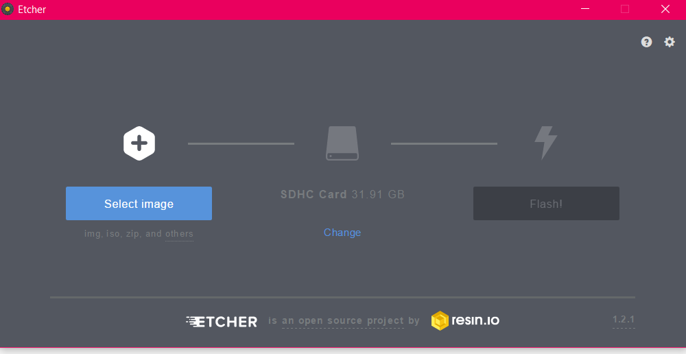

  Fig 1: Select Image from Etcher

 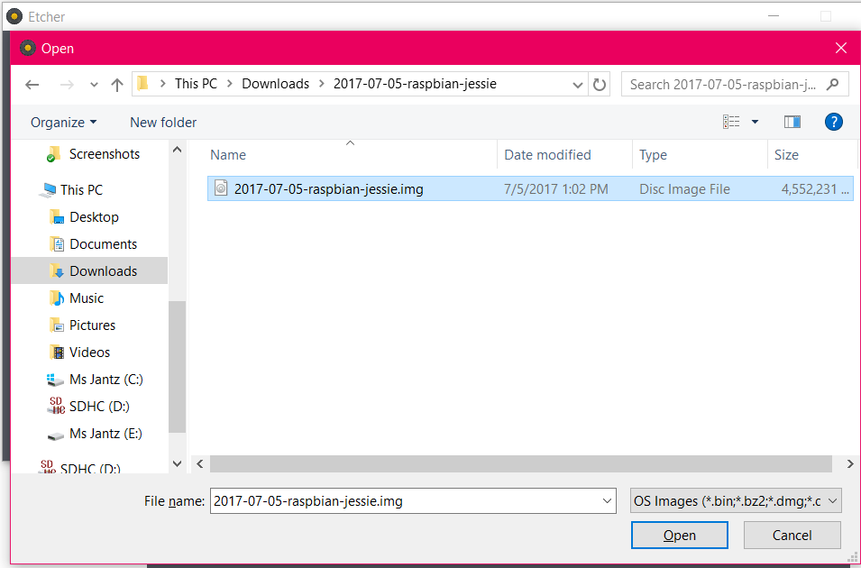

 Fig 2: Raspbian Jessie Image Navigate

 

 Fig 3: Flash to SD CARD

This would take upto 10-15 minutes to Flash and have the Operating System(OS) validated.

Once we have the OS flashed and validated, plug in the SD card into the raspberry PI and connect it to a monitor, the power cord to raspberry Pi, a ethernet cable and test the connectivity. The monitor should display the newly flashed operating system booting up.
We should be able to see the home screen.

---------------------------------------
# **Configuring Wi-Fi**
Start by booting up the Raspberry PI connected to a display and a keyboard, Open up the Terminal and update the Interfaces file, give in the command-

>  sudo nano /etc/network/interfaces

Add the line below to auto connect to the networks from the Supplicant file-

>auto wlan0

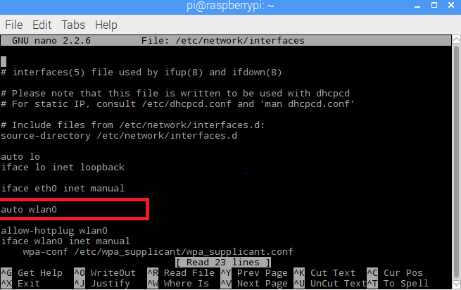
ctrl-X, then type Y to quit and save

Open up the wpa_supplicant file from the terminal and add your network details within this file-
Type in the command:

> sudo nano /etc/wpa_supplicant/wpa_supplicant.conf

Give in your network details -

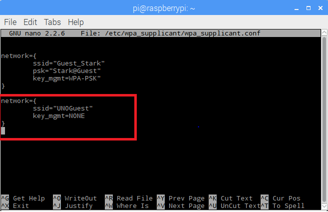

---------------------------------------
# **Setting Up Static Address - Raspberry PI**
First of all, find out the IP address of the PI and the gateway address, type in the command ifconfig to find out the IP address-
> ifconfig
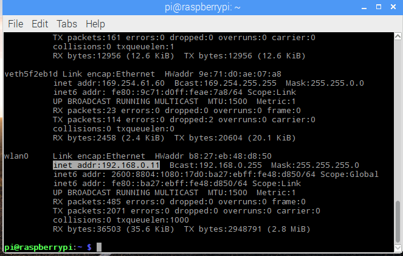

The inet addr gives the IP address, you can either check the IP address of the wlan0(WiFi) or ethernet(eth0). We are setting the IP addres static for wifi.

We also have to find the gateway address, type in the command below-

> netstat -nr

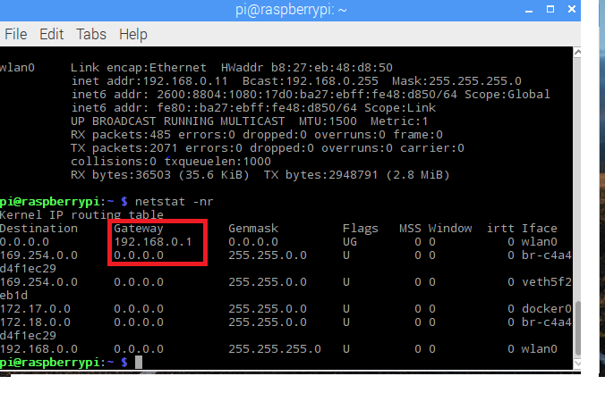

Now change the dhcp configuration file to keep the IP address static.

> sudo nano /etc/dhcpcd.conf

Type in the following to make changes in the conf file-

> interface wlan0
        static ip_address=192.168.0.100
        static routers= 192.168.0.1
        static_domain_servers=8.8.8.8

Here, static ip_address needs to be the IP address that you would like to set, static routers would be your gateway address.

Update these changes and save the conf file. now reboot the PI by giving in-

> sudo reboot

The IP address of the Wlan0 is now static and would be static when you are in your local network.

---------------------------------------
# **Installing Openag\_brain with Docker**

Click on the terminal and run the following commands to install the brain on the raspberry Pi for the OpenAg project.

Things required here are:

1.  Raspberry Pi3 with Raspbian Jesse pre-installed.

2.  Arduino Mega

Note: If you do not want the camera, disable the service from
docker-composer.yml file –

We wanted to flash the Arduino, so currently disabled the service for camera by commenting the line in devices as highlighted below-

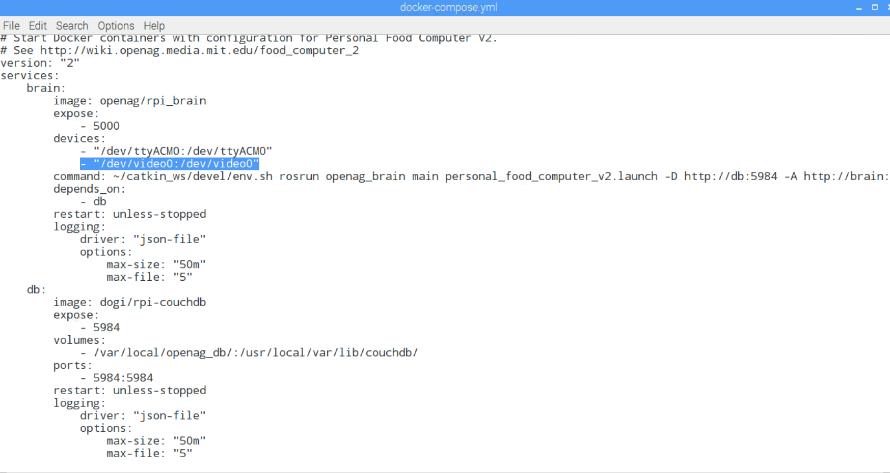

First, clone this repository on your Raspberry Pi

> git clone https://github.com/OpenAgInitiative/openag\_brain\_docker\_rpi

After cloning the repository, change the directory to
openag\_brain\_docker\_rpi by running the command

> cd openag\_brain\_docker\_rpi

Once we navigate to this directory, we can install docker by running a shell script.

> sh install\_docker.sh

After the installation, restart the operating system.

Start a new terminal session in order for the installation to complete.
Then, the project can be started by running the following:

> docker-compose up -d

The docker containers that are up and running can be seen by giving in the following command-

> docker ps

To check all the logs, if they are working right, give in this command-

> docker logs -f openagbraindockerrpi\_brain\_1

To configure the docker, give in the command-

> docker exec -it openagbraindockerrpi\_brain\_1 bash

When we were trying to flash into the Arduino, the error message that we were getting continuosly was–

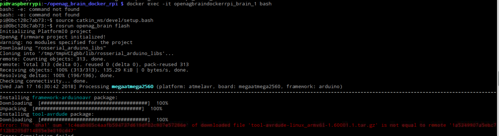

We tried to upgrade the platform with the following command to fix the issue-

> platformio upgrade

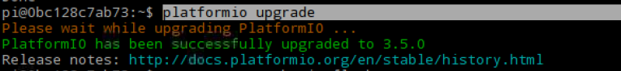

You might notice your cursor prompt will have different text in front of
it. You may also get a few short errors. Disregard them. You are now
INSIDE the docker container where ROS and the OpenAg brain are running!

To initialize the workspace, run the command:

> source catkin\_ws/devel/setup.bash

To flash the Arduino you need to unplug the USB cord from the RaspberryPi an d plug it into a different USB port. Alternatively you can wait 30
seconds and plug it into the same port. This frees the port from other services blocking our way.

Once you've plugged the Arduino back in and type this command:

> rosrun openag\_brain flash

We need to make sure the process exits with SUCCESS. You may need to try this process a few times. Once it does reach around and pat yourself on
the back. You've got a OpenAg brain running!!!

Let's restart the docker container to make sure it's clean and happy and
explore ROS.

Type this command to leave the docker container:

> exit

Then restart the docker containers. Don't worry you won't lose your
changes.

> docker-compose restart

Now let's go back into the container with this command:

> docker exec -it openagbraindockerrpi\_brain\_1 bash

Re-initialize your workspace. You have to do this everytime you restart
the docker container for now.

> source catkin\_ws/devel/setup.bash

Let's take a look at the ROS topics:

> rostopic list

If you would want to check the output of your topics on your Terminal screen, type in the command:

> rostopic echo <name of the topic that you want to see output>

Please note, We need to run the following commands everytime we need to start the containers.

> docker-compose up-d
>
> docker exec -it openagbraindockerrpi\_brain\_1 bash
>
> source catkin\_ws/devel/setup.bash
----------------------------------

# **Installing UI**

To setup the control panel or the UI for the OpenAg food computer run
the following command by changing the directory to the root directory.

These shell commands have to be run in the terminal.

We first have to install nodejs/npm

> curl -sL https://deb.nodesource.com/setup\_6.x | sudo -E bash

> sudo apt-get install -y nodejs

Get the code for the UI by running the command to clone from the
repository below.

> git clone <https://github.com/OpenAgInitiative/openag_ui>

To build and deploy, execute the commands below.

> cd openag\_ui

> npm install

> npm run couchapp\_deploy --app\_db\_url="http://localhost:5984/app"

To access the UI locally, replace the IP OF FOOD COMPUTER with localhost

> <http://localhost:5984/app/_design/app/_rewrite>

# **Installing Arduino IDE**

First of all, we need to make sure that our Raspbian Jesse OS is up to date, to do this type in the following command from the terminal of your RaspberryPi

> sudo apt-get update

Then do a upgrade-
> sudo apt-get upgrade

Now, install the IDE by giving in the following command-

> sudo apt-get install arduino

You can check the IDE, by navigating to the Start button > Programming > Arduino IDE:

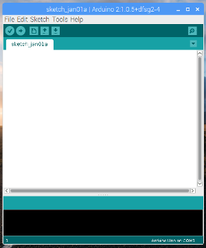

# **Setting up the Camera**
To enable the Camera module on the pi, type in the following command-

> sudo raspi-config

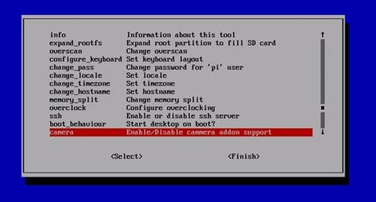

Navigate to the camera option and enable it, then select "Finish", reboot the RaspberryPi.

Now, install the package required for the camera module:

> sudo apt-get install fswebcam

To install the dependent libraries, run the below command.
> sudo apt-get install libav-tools

To test if the camera is working properly, try to capture the image by typing in the following command-

> fswebcam -r 640x480 --jpeg 85 -D 1 web-cam-shot.jpg

To capture a video for a certain duration:

We need to have a media player to watch the video that can be captured by the USB camera, we have used VLC media player for our purpose:

> sudo apt-get install vlc

Now run the below command where t defines the duration of capture.

> avconv -t 10 -f video4linux2 -i /dev/video0 video0.avi
