## Assemble the Brain Module

### Tools
 - Small Flathead Screwdriver
 - Medium Phillips Screwdriver
 - Standard Hex Driver Set
 - Wire Cutters

### Instructions
 1. Gather materials for this submodule. See BOM-Master's PFC2-MOD-0001 tab
 2. Peel off the protective covering on both sides of the **Brain Manifold Panel** & **Raspberry Pi Mounting Panel**
 3. Attach x8 of the **S-#08-32-100-STD-H-AL-FF (Bag 7)** (8-32 x 1" Aluminum Standoffs) to the Brain Manifold Panel with x8 of the **S-#08-32-050-BTN-S-SS (Bag 3)** (8-32 x 1/2" Button Head Screws) as shown in 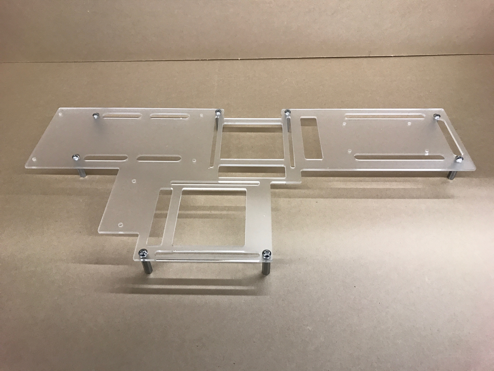
 4. Attach an **8-Pos Barrier Block Jumpers** (PWR-BUS-0002) to a single side of the **8-Pos Barrier Block** (PWR-BUS-0001). Attach the jumper to all x4 blocks.
 5. Mount x4 of the **8-Pos Barrier Blocks** to the **Brain Manifold Panel** with x16 of the **S-#04-40-050-BTN-S-SS (Bag 11)** (4-40 x 1/2" Button Head Screws) and x16 of the **S-#04-40-094-NUT-H-SS (Bag 15)** (4-40 Nuts) as shown in 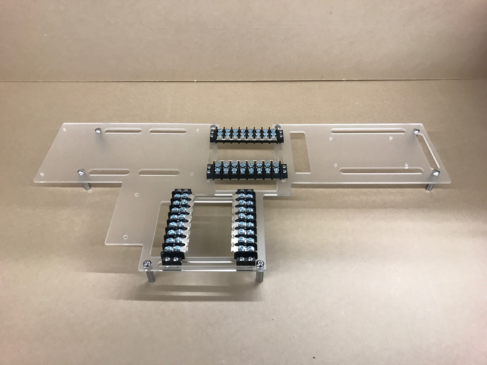
 6. Mount the **16-Channel Relay Board** (ELC-REL-0001) to the **Brain Manifold Panel** with x4 of the **S-#04-40-025-STD-H-AL-MF (Bag 17)** (4-40 x 1/4" Body Aluminum Standoff 3/16" Length, Male-to-Female), x4 of the **S-#04-40-075-STD-H-AL-FF (Bag 16)** (4-40 x 3/4" Aluminum Standoff Female-to-Female), and x4 of the **S-#04-40-025-BTN-S-SS (Bag 13)** (4-40 x 1/4" Button Head Screws)
 7. Mount the **Raspberry Pi 3 Model B** (ELC-PRC-0002) to the **Raspberry Pi Mounting Plate** (STR-PNL-0015) with x4 of the **S-#04-40-125-BTN-S-SS (Bag 12)** (4-40 x 1/8" Button Head Screws), x4 of the **S-#04-40-025-STD-H-NY-FF (Bag 18)** (4-40 x 1/4" Nylon Standoffs), and x4 of the **S-#04-40-025-BTN-S-SS (Bag 13)** (4-40 x 1/4" Button Head Screw)
 8. Mount this panel on top of the **16-Channel Relay Board** with x4 of the **S-#04-40-025-BTN-S-SS (Bag 13)** (4-40 x 1/4" Button Head Screws). The assembly should now look like 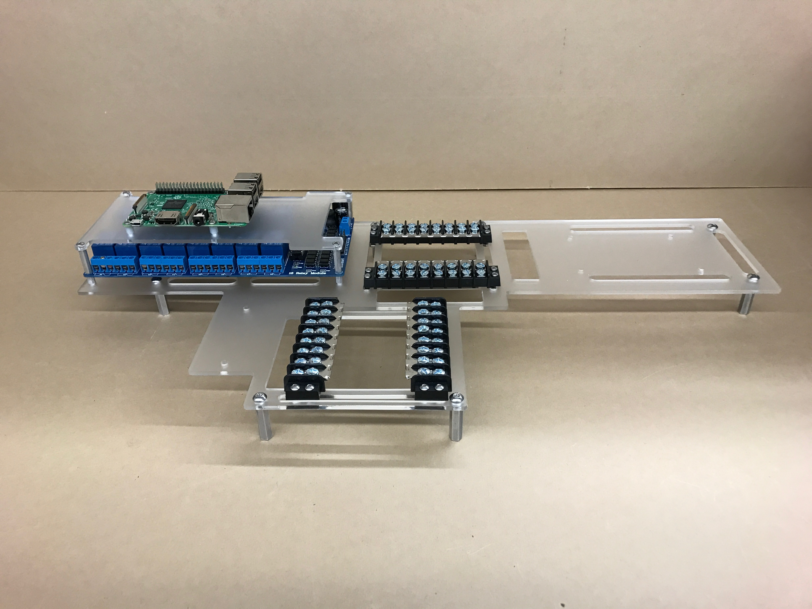
 9. Mount the **Arduino Mega** (ELC-PRC-0001) to the **Brain Manifold Panel** with x4 of the **S-#04-40-025-STD-H-NY-FF (Bag 18)** (4-40 x 1/4" Nylon Standoffs), x4 of the **S-#04-40-025-BTN-S-SS (Bag 13)** (4-40 x 1/4" Button Head Screws), and x4 of the **S-#04-40-125-BTN-S-SS (Bag 12)** (4-40 x 1/8" Button Head Screws)
 10. Use the Arduino's **USB A-to-B Cable** (WIR-CBL-0014)to connect the **Arduino Mega** to the **Raspberry Pi**. Route this cable on the under side of the panel.
 11. Stack the **OpenAg Signal Board v1.0** (ELC-PCB-0001) onto the **Arduino Mega**
 12. Connect the row of 2x10 male header pins on the **Signal Board** to the row of 2x10 male header pins on the **16-Channel Relay Board** with the **20 Pos IDC Ribbon Cable 48cm, Rainbow Colored**. **IMPORTANT: The black wire on the outer edge of the ribbon cable should be in line with pins 44 & 45 on the signal board and 5V on the 16-channel relay board**. Be sure to check this with the picture below: 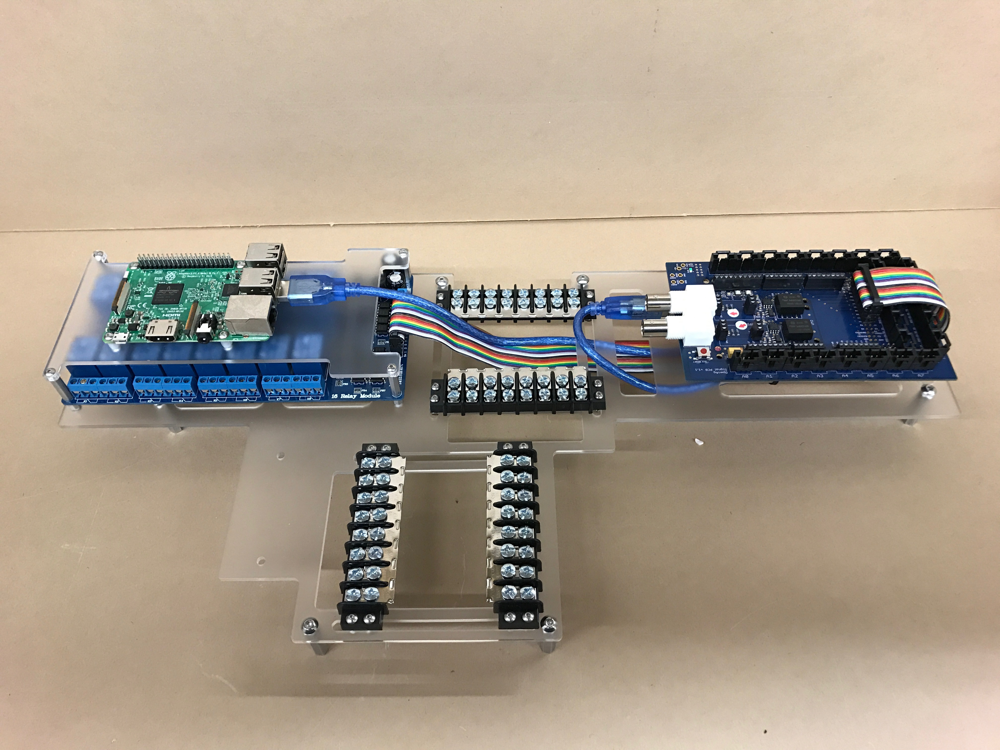
 13. Tape the **20 Pos IDC Ribbon Cable 48cm, Rainbow Colored** and the **USB A-to-B Cable** together and zip tie to the back side of the brain panel. See picture below: 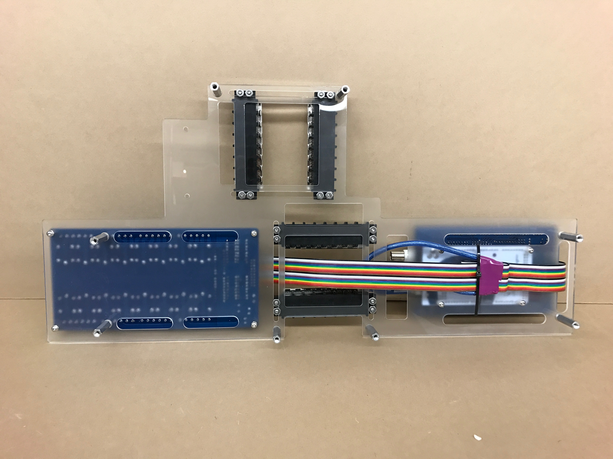
 14. Mount the **Connectorized Step-down Regulator with Micro USB Connector** (PWR-REG-CZD-0001) to the **Brain Manifold Panel** with x2 of the **S-#04-40-375-BTN-S-SS (Bag 14)** (4-40 x 3/8" Button Head Screws) and x2 of the **S-#04-40-094-NUT-H-SS (Bag 15)** (4-40 Nuts). Connect the red wire to 12V Bus 2, Terminal 16, the black wire to  GND Bus 2, Terminal 1, and the micro usb cable to the Raspberry Pi Micro USB Power Port. See image below: 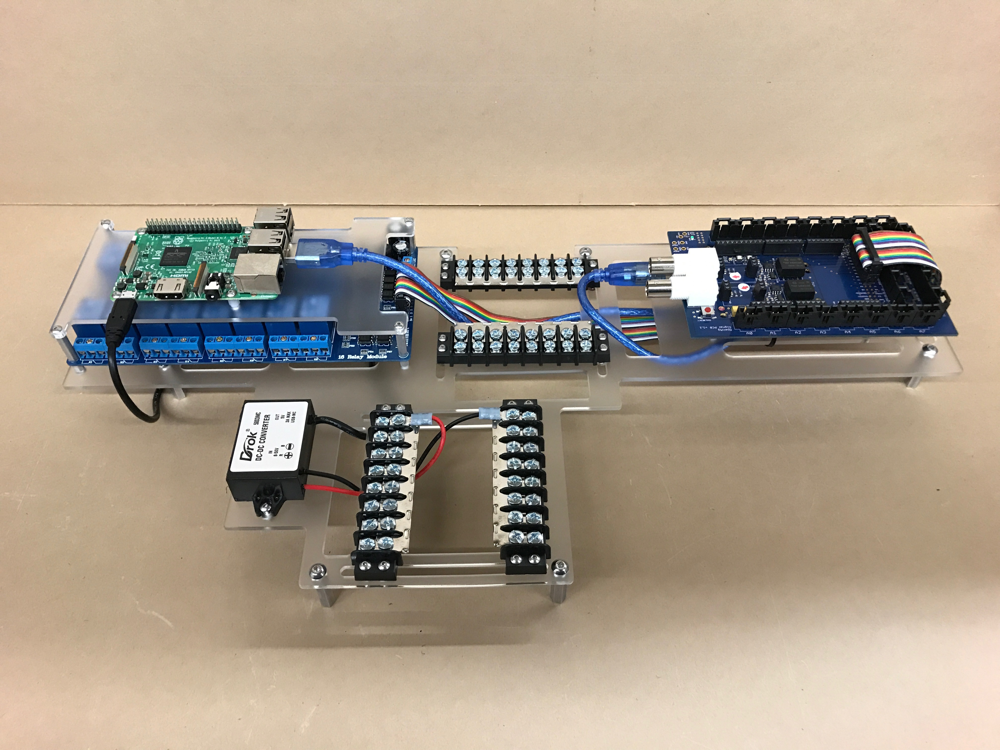
 15. Connect Relay Block VIN	to 12V Bus 1, Terminal 1 with **8 Stud 14-16 AWG Spade Terminal with 2" Red Wire Lead** (WIR-HAR-0001)
 16. Connect Relay Block GND to	GND Bus 1, Terminal 16 with **8 Stud 14-16 AWG Spade Terminal with 2.5" Black Wire Lead** (WIR-HAR-0002). See photo below: 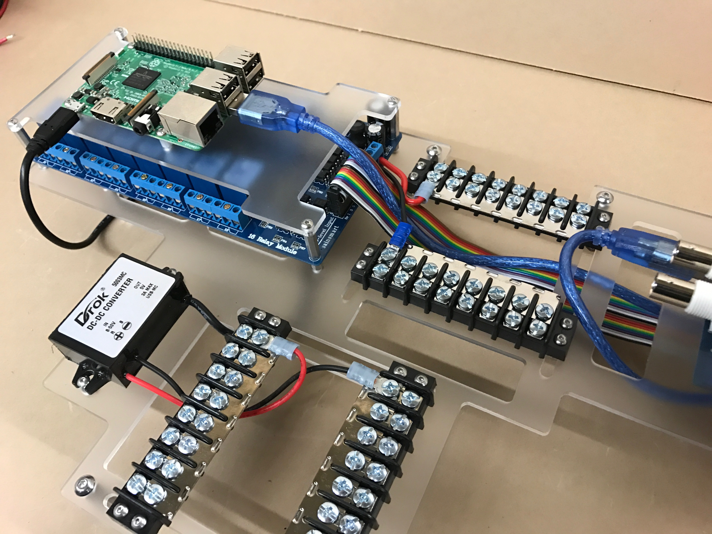
 17. Connect Relay Block COM from K2-8 to 12V Bus 2, Terminal 2-8 with x7 of the **8 Stud 14-16 AWG Spade Terminal with 10" Red Wire Lead** (WIR-HAR-0003). Use the Wire Cutter to trim the ends of the leads so they fit perfectly into the screw-down terminal. There should not be any exposed wire protruding from the terminal.
 18. Connect Relay Block COM from K10-16 to 12V Bus 1, Terminal 10-16 with x7 of the **8 Stud 14-16 AWG Spade Terminal with 10" Red Wire Lead** (WIR-HAR-0003). Use the Wire Cutter to trim the ends of the leads so they fit perfectly into the screw-down terminal. There should not be any exposed wire protruding from the terminal. See Photos below: 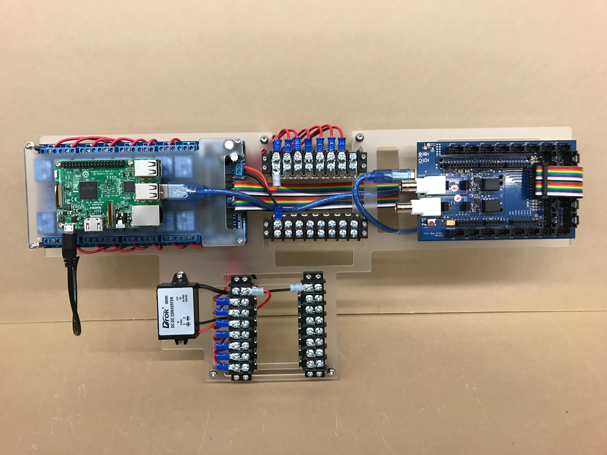 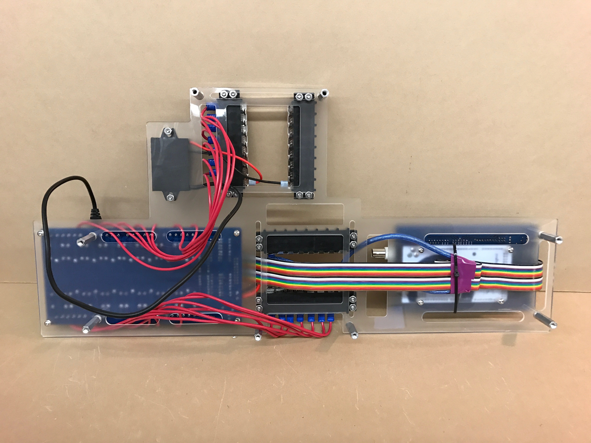
 19. Connect **Molex JR 2-Pos Recepticle to 8 Stud 14-16 AWG Spade Terminals with "12V@1" Label, 10" Leads** (WIR-HAR-0005) red wire to 12V Bus 1, Terminal 2 and black wire to GND Bus 1, Terminal 15
 20. Connect **Molex JR 2-Pos Recepticle to 8 Stud 14-16 AWG Spade Terminals with "12V@2" Label, 10" Black Lead, 8" Red Lead** (WIR-HAR-0006) red wire to 12V Bus 2, Terminal 1 and black wire to GND Bus 2, Terminal 2
 21. Connect **Molex JR 2-Pos Recepticle-to-Recepticle with "12V@3" and "K1" Labels on 21" Red Leads with 15" Black Interconnect** (WIR-HAR-0007) "K1-COM" labelled red wire to K1-COM and the "K1-NO" labelled red wire to K1-NO on the **16-Channel Relay Board**
 22. Connect **Molex JR 2-Pos Recepticle-to-Recepticle with "12V@4" and "K9" Labels on 21" Red Leads with 15" Black Interconnect** (WIR-HAR-0036) "K9-COM" labelled red wire to K9-COM and the "K9-NO" labelled red wire to K9-NO on the **16-Channel Relay Board**
 23. Bundle together the 12V@1, 12V@2, 12V@3, 12V@4, along with one end of the **Molex JR 2-Pos Recepticle-to-Recepticle Cable with "24V" Label, 26"** (WIR-HAR-0004) and zip tie them together as shown in 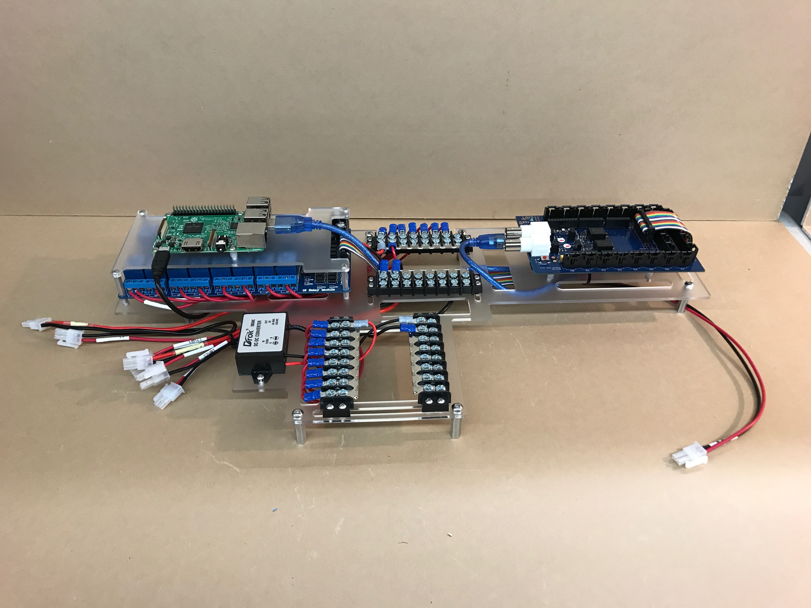 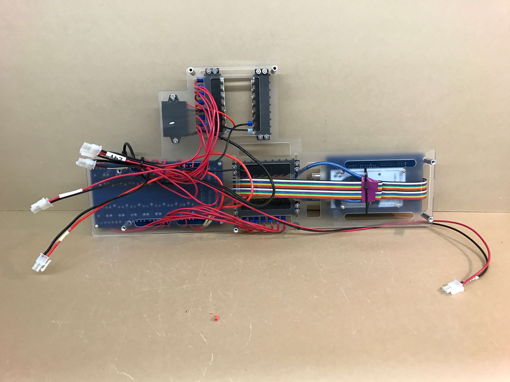
 24. Connect **Molex JR 2-Pos Recepticle with "K2" Label to 21" Black Lead with 8 Stud 14-16 AWG Spade Terminals, 24" Red Lead** (WIR-HAR-0008) black wire to	GND Bus 2, Terminal 3 and red wire to Relay Block K2-NO
 25. Connect **Molex JR 2-Pos Recepticle with "K3" Label to 21" Black Lead with 8 Stud 14-16 AWG Spade Terminals, 24" Red Lead** (WIR-HAR-0009) black wire to	GND Bus 2, Terminal 4 and red wire to Relay Block K3-NO
 26. Connect **Molex JR 2-Pos Recepticle with "K4" Label to 21" Black Lead with 8 Stud 14-16 AWG Spade Terminals, 24" Red Lead** (WIR-HAR-0010) black wire to	GND Bus 2, Terminal 5 and red wire to Relay Block K4-NO
 27. Bundle together K2, K3, and K4 then zip tie them together near the end of the recepticle as shown: 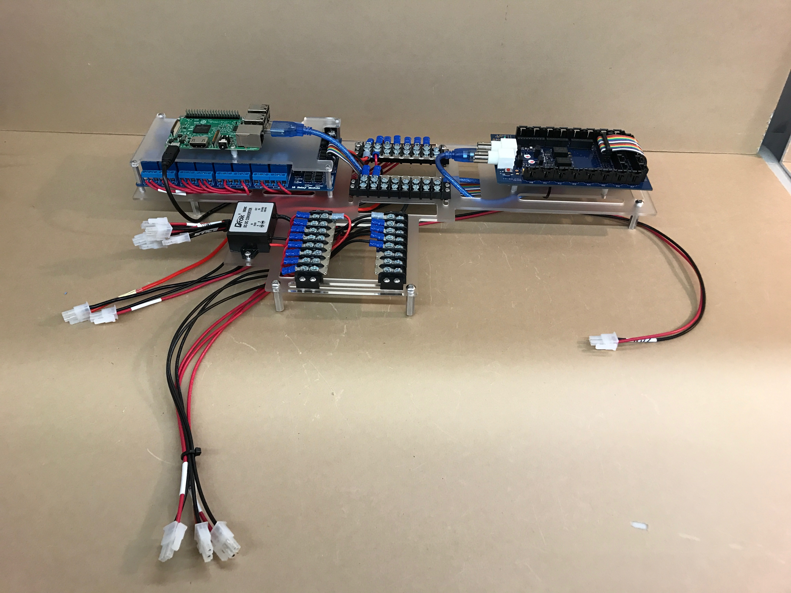 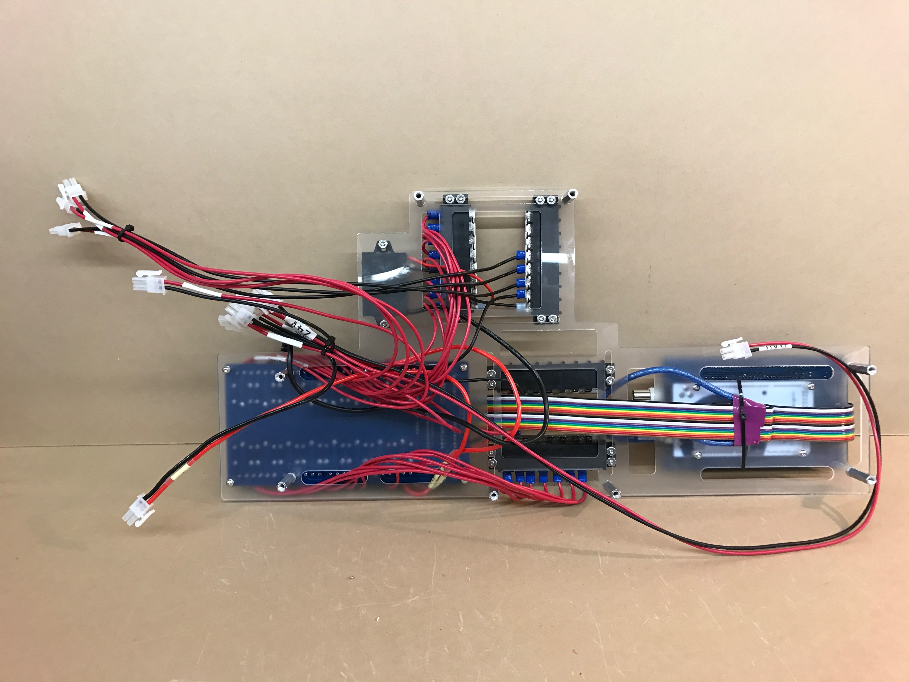
 28. Connect **Molex JR 2-Pos Recepticle with "K5" Label to 17" Black Lead with 8 Stud 14-16 AWG Spade Terminals, 18" Red Lead** (WIR-HAR-0011) black wire to	GND Bus 2, Terminal 6 and red wire to Relay Block K5-NO
 29. Bundle together K1, K5, and K9 such that they are staggered by a little more than a connectors length then zip tie them together.
 30.  Connect **Molex JR 2-Pos Recepticle with "K6" Label to 36" Black Lead with 8 Stud 14-16 AWG Spade Terminals, 42" Red Lead** (WIR-HAR-0012) black wire to	GND Bus 1, Terminal 6 and red wire to Relay Block K6-NO
 31.  Connect **Molex JR 2-Pos Recepticle with "K7" Label to 30" Black Lead with 8 Stud 14-16 AWG Spade Terminals, 36" Red Lead** (WIR-HAR-0013) black wire to	GND Bus 1, Terminal 7 and red wire to Relay Block K7-NO
 32. Connect **Molex JR 3-Pos Recepticles with "K8@1" and "K8@2" Labels, Spliced together with "K8-NC" and "K8-NO" labelled leads** (WIR-HAR-0014) K8@1 black wire to GND Bus 1, Terminal 8, K8@2 black wire to GND Bus 2, Terminal 7, red wire labelled "K8-NC" to Relay Block K8-NC and red wire labelled "K8-COM" to Relay Block K8-COM
 33. Connect **Molex SR 4-Pos Recepticle-to-Plug with "D3" Labels, 26"** (WIR-HAR-0022) to Signal Board D3
 34. Connect **Molex SR 4-Pos Recepticle-to-Plug with "D4" Labels, 26"** (WIR-HAR-0023) to Signal Board D4
 35. Bundle together K6, K7, K8@1, D3, and D4 then zip tie them together 8" away from the end connectors as shown below
 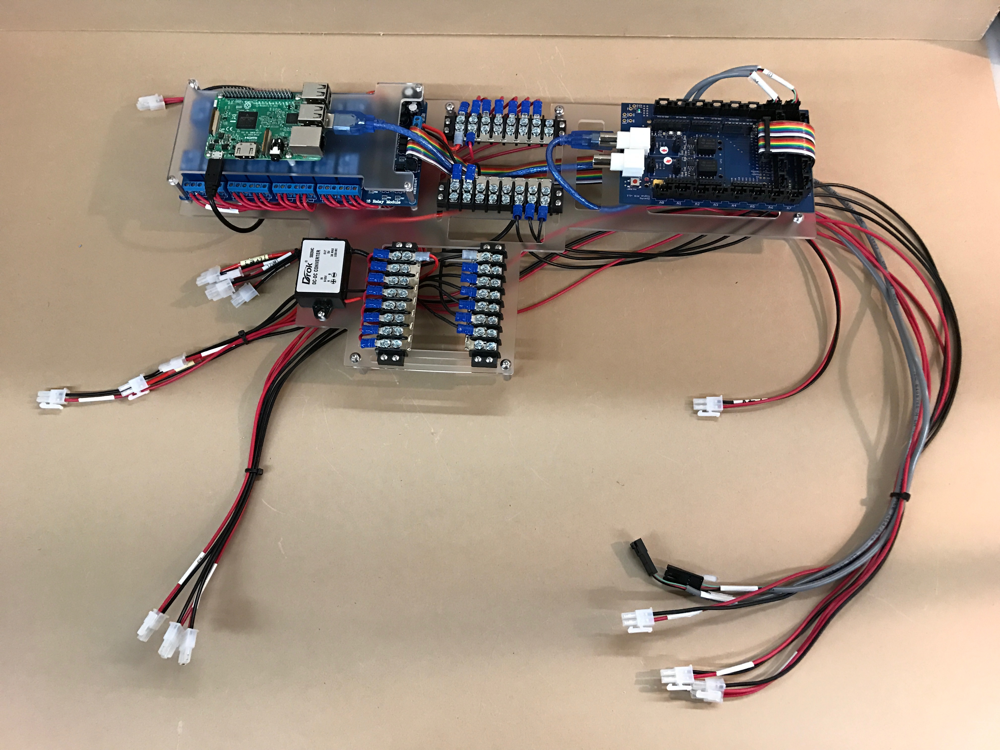
 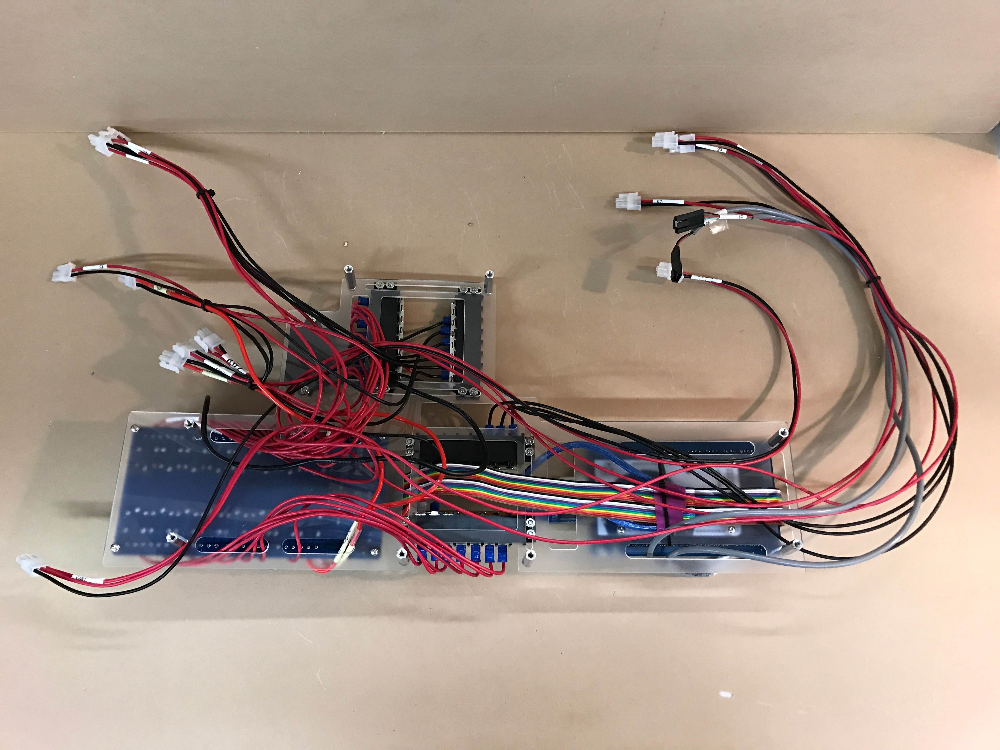
 36. Connect **Molex JR 2-Pos Recepticle with "K10" Label to 22" Black Lead with 8 Stud 14-16 AWG Spade Terminals, 29" Red Lead** (WIR-HAR-0015) black wire to GND Bus 1, Terminal 4 and red wire to K10-NO
 37. Connect **Molex JR 2-Pos Recepticle with "K11" Label to 22" Black Lead with 8 Stud 14-16 AWG Spade Terminals, 29" Red Lead** (WIR-HAR-0016) black wire to GND Bus 1, Terminal 5 and red wire to K11-NO
 38. Bundle together K10, K11, and 24V and zip tie together
 39. Connect **Molex JR 2-Pos Recepticle with "K12" Label to 19" Black Lead with 8 Stud 14-16 AWG Spade Terminals, 27" Red Lead** (WIR-HAR-0017) black wire to GND Bus 1, Terminal 10 and red wire to K12-NO
 40. Connect **Molex JR 2-Pos Recepticle with "K13" Label to 19" Black Lead with 8 Stud 14-16 AWG Spade Terminals, 27" Red Lead** (WIR-HAR-0018) black wire to GND Bus 1, Terminal 11 and red wire to K13-NO
 41. Connect **Molex JR 2-Pos Recepticle with "K14" Label to 19" Black Lead with 8 Stud 14-16 AWG Spade Terminals, 27" Red Lead** (WIR-HAR-0019) black wire to GND Bus 1, Terminal 12 and red wire to K14-NO
 42. Connect **Molex JR 2-Pos Recepticle with "K15" Label to 19" Black Lead with 8 Stud 14-16 AWG Spade Terminals, 27" Red Lead** (WIR-HAR-0020) black wire to GND Bus 1, Terminal 13 and red wire to K15-NO
 43. Connect **Molex JR 2-Pos Recepticle with "K16" Label to 19" Black Lead with 8 Stud 14-16 AWG Spade Terminals, 27" Red Lead** (WIR-HAR-0021) black wire to GND Bus 1, Terminal 14 and red wire to K16-NO
 44. Bundle together K12, K13, K14, K15, and K16 and zip tie them together.
 45. Connect **Inline Barrel Plug with Leads, Connectorized** (WIR-CBL-CZD-0001) black wire to GND Bus 1, Terminal 9, red wire to 12V Bus 1, Terminal 9, and the barrel plug to the **Arduino Mega** Barrel Jack. The assembly should now look something like this:
 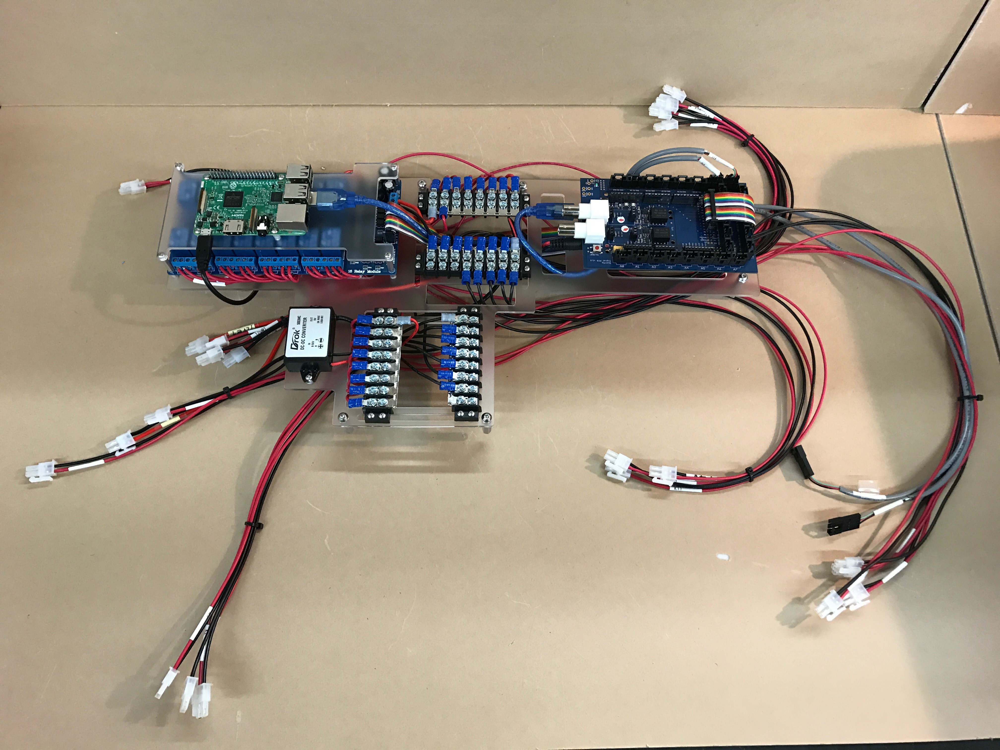
 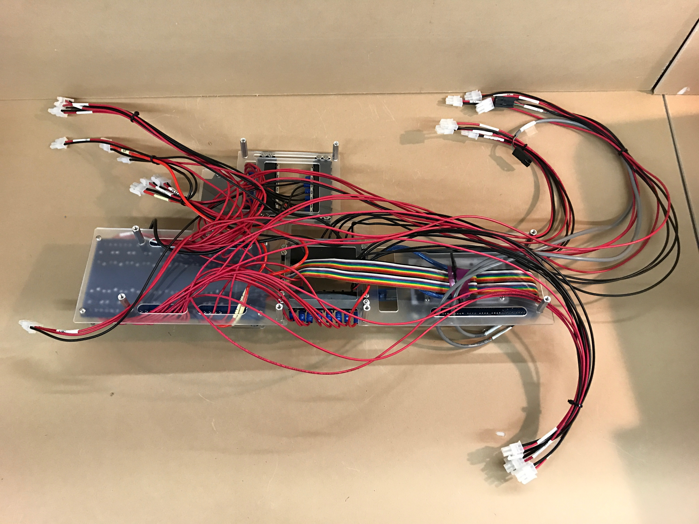
 46. Bundle the ratsnest on the back side into an orderly wire route by starting at the edges of the bundle and then moving inward. For example, bundle the all the red wires near the 12V bus that are close to each other. Do this for all the power bus bars. Then, move to the connectors on the other side of the wires and make sure the red and black wires coming into the them are of even lengths. Slowly tie the wires into the "main veins" and adjust as needed to make the routing look clean. It may be helpful to use place holder zip-ties in the process to help organize the clutter. Make sure the wires end up routed as they are in the photo below:

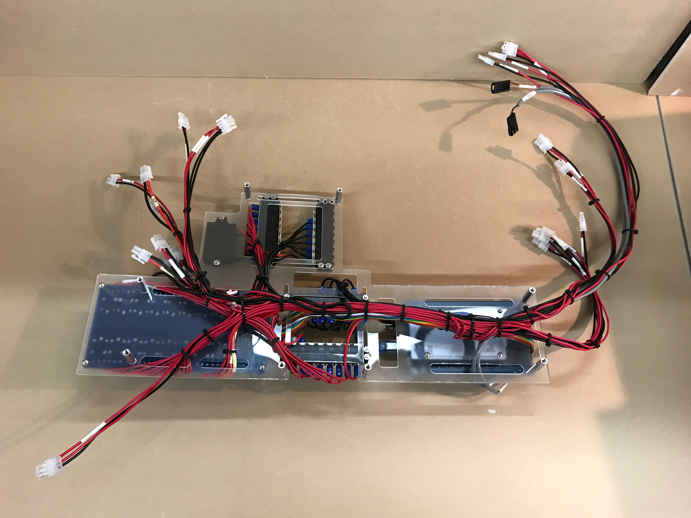

### Mounting the Brain Manifold
1. Before Mounting the Brain Manifold, Make sure to route the wire harness around the Standoffs as seen here: 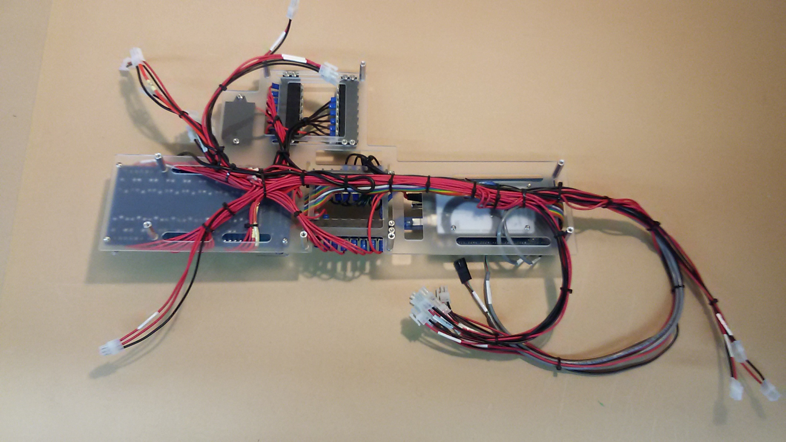
2. The Brain Manifold is mounted via x8 **S-#08-32-050-BTN-S-SS (Bag 3)** (8-32 x 050 button head) screws. Note the mounting position. 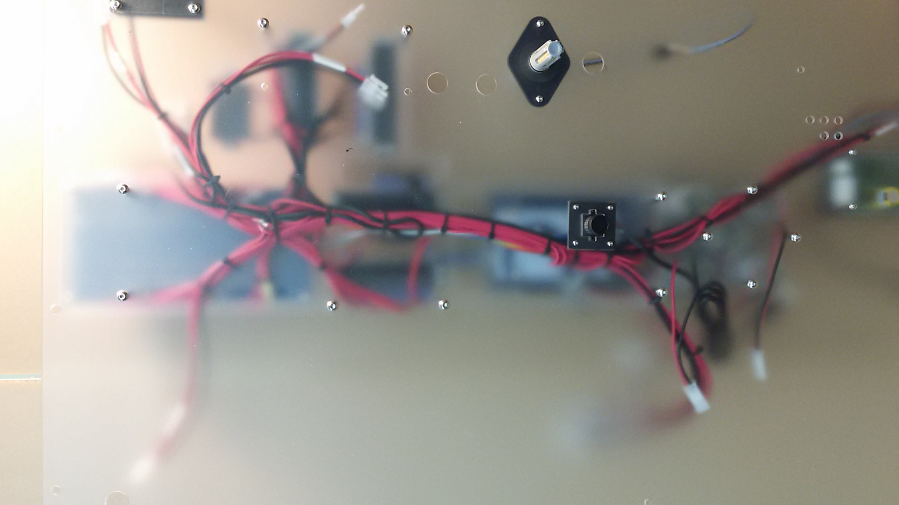
