## Assemble the Power Module
:house: [Back to Hardware Build](https://github.com/SachinPawaskarUNO/mav-openag-foodcomputer2.0/blob/master/docs/HardwareFabrication.md)||
[Next-Water Manifold](./Instructions/water_manifold.md)

### Tools
 - Balldriver Set, Standard
 - Balldriver Set, Metric
 - Nutdriver Set, Standard
 - Nutdriver Set, Metric
 - Wire Cutters
 - Pliars
 - Phillips Head Screwdriver

### Instructions
 1. Gather all materials for this subassembly as shown: 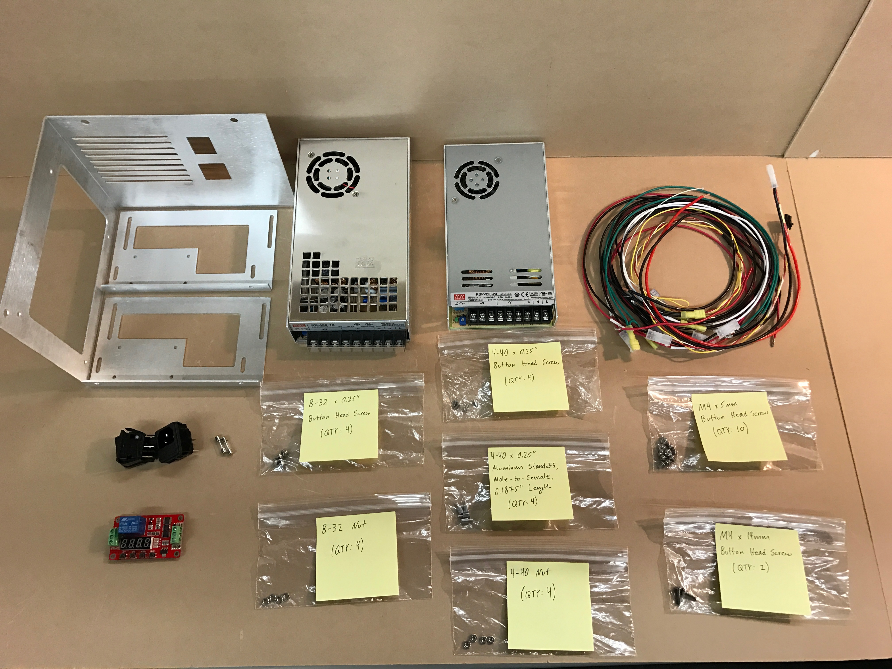
 2. **PLEASE READ, THIS IS VERY IMPORTANT: Set the 12V power supply to either 115V or 230V depending on where you live. If you do not do this properly, this will damage the suppy and make it unusable.**
 3. Insert x2 of the **Glass Fuses** (ELC-FUS-0001) into the **Power Entry Module** (ELC-PEM-0001) as shown: 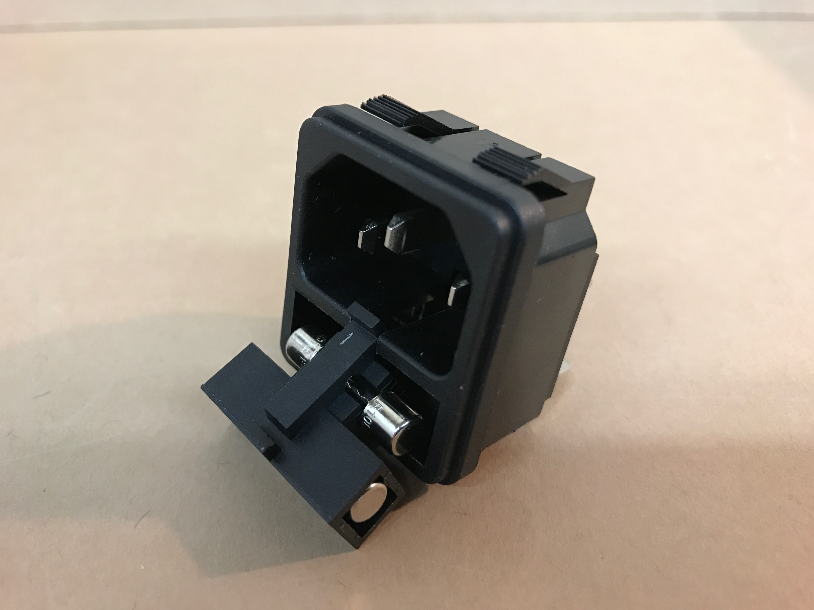
 4. Insert the **Fused Power Entry Module** and **Power Switch** (ELC-SWI-0001) into the **Large Power Supply Bracket** (STR-PNL-0002) as shown. **IMPORTANT: Make sure to have the correct orientation as it is very difficult to take them back out after they are inserted** 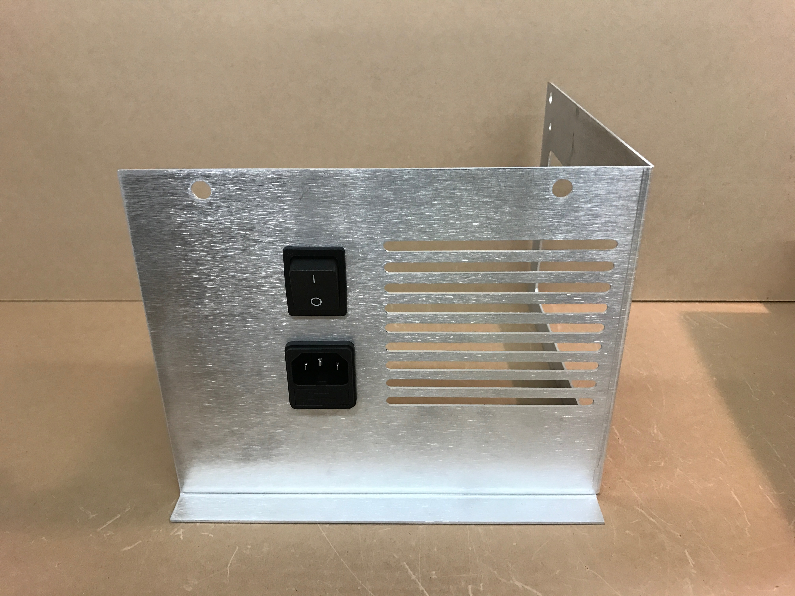
 5. Mount the **Multifunction Programmable Relay Timer** (ELC-REL-0002) to one of the **Small Power Supply Brackets** (STR-PNL-0003) with x4 of the **S-#04-40-025-BTN-S-SS (Bag 13)** (4-40 x 0.25" Button Head Screws), x4 of the **S-#04-40-025-STD-H-AL-MF (Bag 17)** (4-40 x 0.25" Aluminum Standoff, Male-to-Female, 0.1875" Length), and x4 of the **S-#04-40-094-NUT-H-SS (Bag 15)** (4-40 Nuts) as shown: 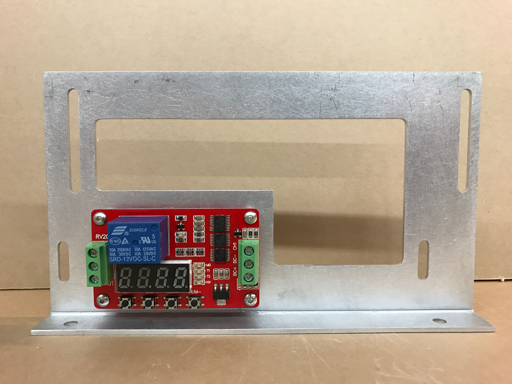
 6. Mount the **Small Power Supply Brackets** to the **Large Power Supply Bracket** with x4 of the **S-#08-32-025-BTN-S-SS (Bag 1)** (8-32 x 0.25" Button Head Screws) and x4 of the **S-#08-32-094-NUT-H-SS (Bag 6)** (8-32 Nuts) as shown: 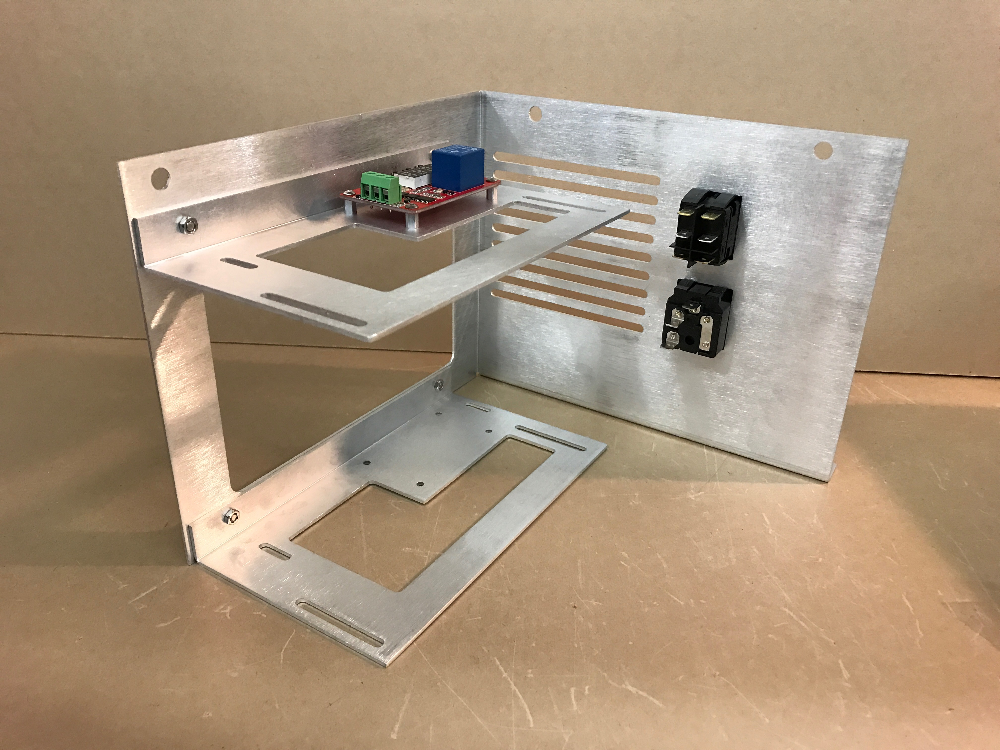
 7. Mount the **24V Power Supply** (PWR-SUP-0001) to the **Assembled Power Supply Brackets** with x2 of the **M-004-07-014-BTN-S-SS (Bag 29)** (M4 x 14mm Button Head Screws) and x2 of the **M-004-07-005-BTN-S-SS (Bag 28)** (M4 x 5mm Button Head Screws) as shown: 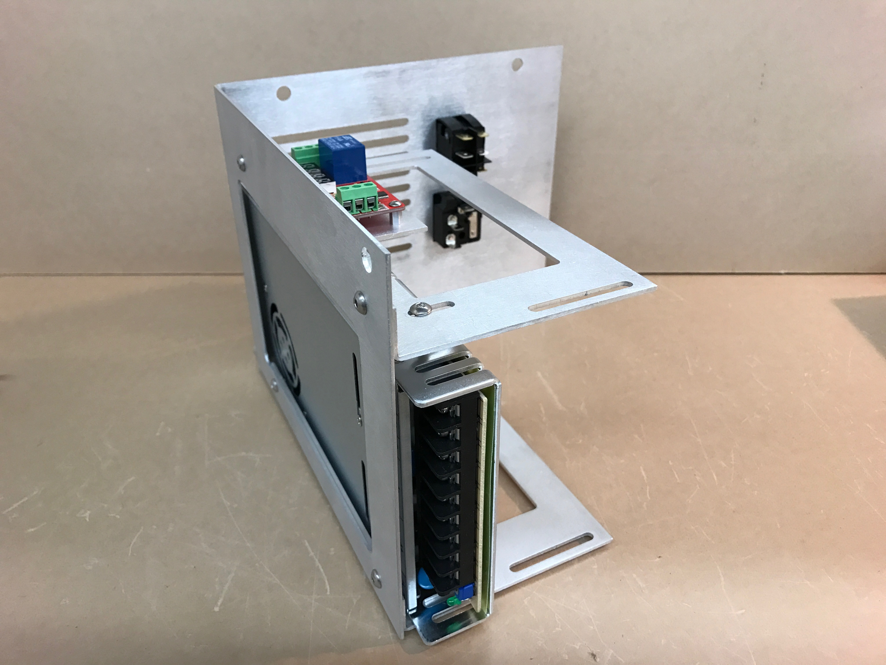
 8. Connect the **Power Entry Module Load** to the **Power Switch Pos 1A** and **Multifunction Relay COM** with **0.250" Female Quick Connect Terminal 10-12 AWG with 17" Black Lead and 3" Black Wire to 0.250" Female Quick Connect Terminal 14-16 AWG** (WIR-HAR-0026) as shown: 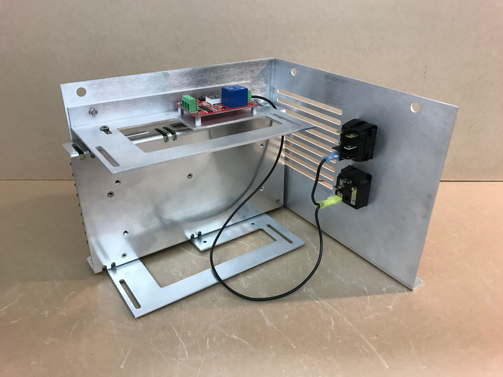
 9. Connect **Power Switch Pos 2A**, **Power Switch Pos 3A**, and **Multifunction Relay NO** with **Double 0.250" Female Quick Connect Terminal 10-12 AWG with 17", 21", and 21" Black Leads with 2" Black Wire Connecting Terminals** (WIR-HAR-0027). Make sure the orientation has the two unconnected black wires of apporximately equal length. See below: 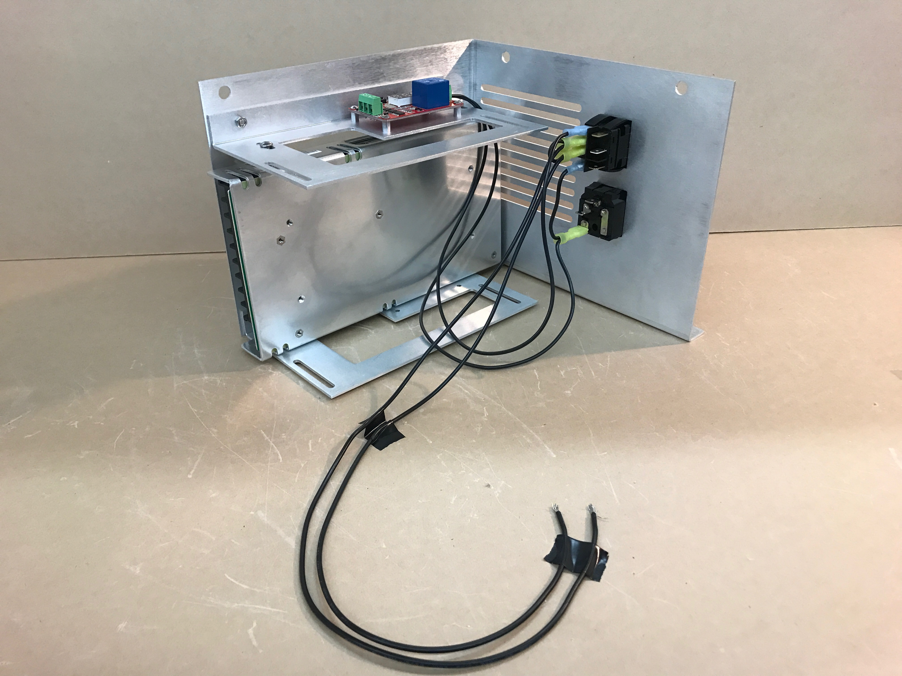
 10. Connect **0.250" Female Quick Connect Terminal 10-12 AWG with Two 18" White Leads** (WIR-HAR-0024) to **Power Entry Module Neutral (N)**
 11. Connect **Double 0.250" Female Quick Connect Terminal 10-12 AWG to Two 19" Green Leads Connected by 4.5" Green Wire** (WIR-HAR-0025) to **Power Entry Module Ground** and **Power Switch Pos 6B**
 12. Connect **Molex SR 4-Pos Plug with "RPI GPIO 11/13/15/17" Label with Varried Length Leads** (WIR-HAR-0034) red wire to **Power Switch Pos 4B** and yellow wire to **Power Switch Pos 5B**. The connections to the power switch and power entry module should now look like: 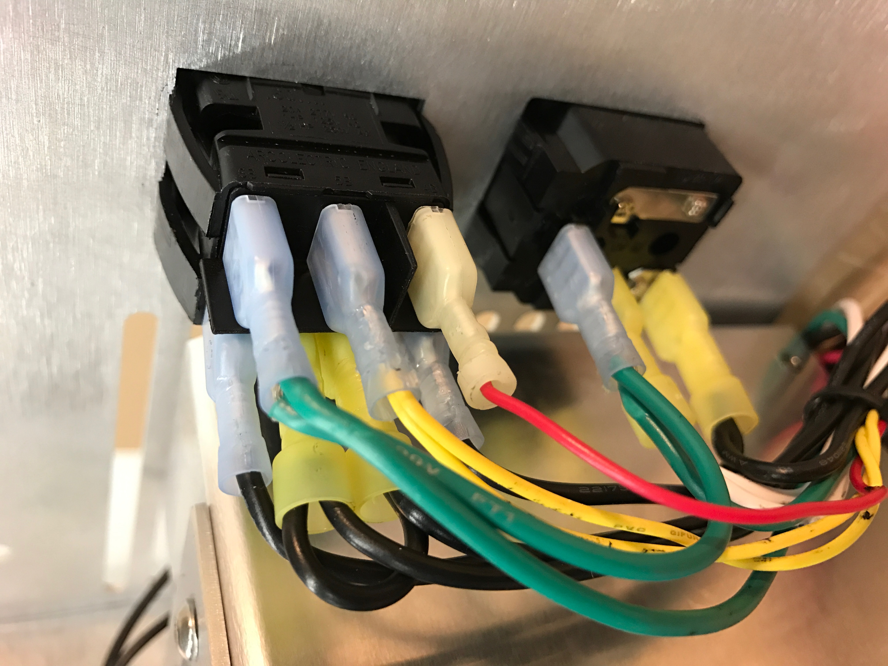
 13. Bundle the wires connecting to the **Power Entry Module** and **Power Switch** and zip  tie them together at the bottom of the **Power Entry Module**
 14. Tape over the entire **Power Entry Module** and **Power Switch** with Electrical Tape as shown: 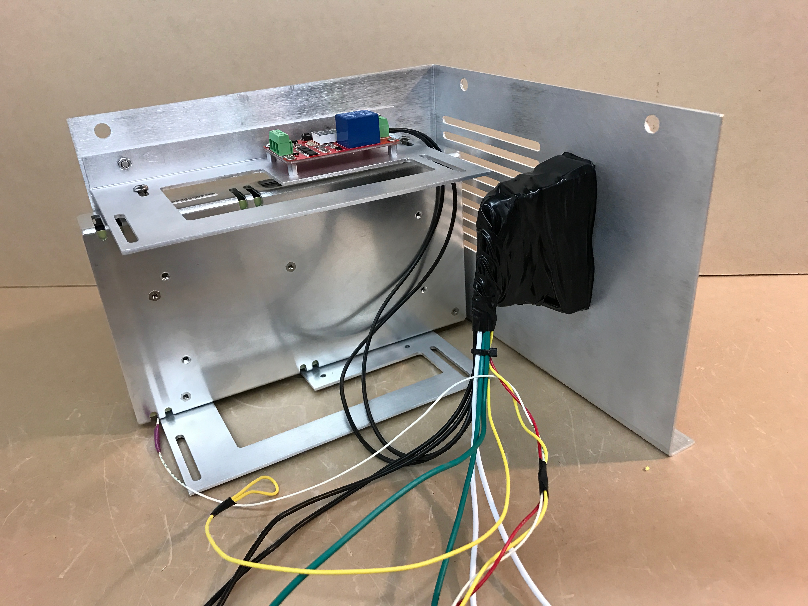
 15. Connect the green wires to the grounds on each power supply
 16. Connect the black wires to the loads (L) on each power supply
 17. Connect the whites to the normals (N) on each power supply
 18. Connect the wire harness labelled 24V to the 24V power supply (black to -V and red to +V)
 19. Connect the wire harnesses labelled 12V@1, 12V@2, 12V@3, 12V@4, and the individual red and black wire harnesses to the 12V power supply (be sure to only put up to 2 wires per terminal)
 20. Connect the white 24 AWG (the skinny one) wire into CH1 on the multifunction relay
 21. Make sure there is tape around the end of the yellow 24 AWG wire and tape it next to the multifunction relay.
 22. Bundle the wires together at the edges (all wires connecting to the 12V supply are one edge, all wires connecting to the 24V supply are another edge, the recepticles are another edge). The assembly should now look like this: 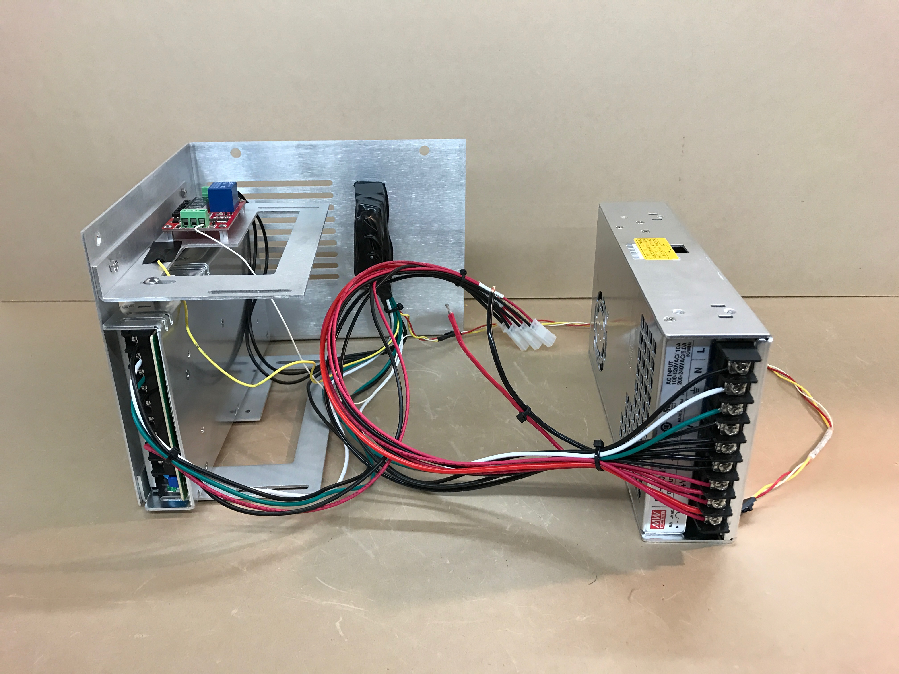
 23. Bundle together the main vein of wires and zip tie together as shown: 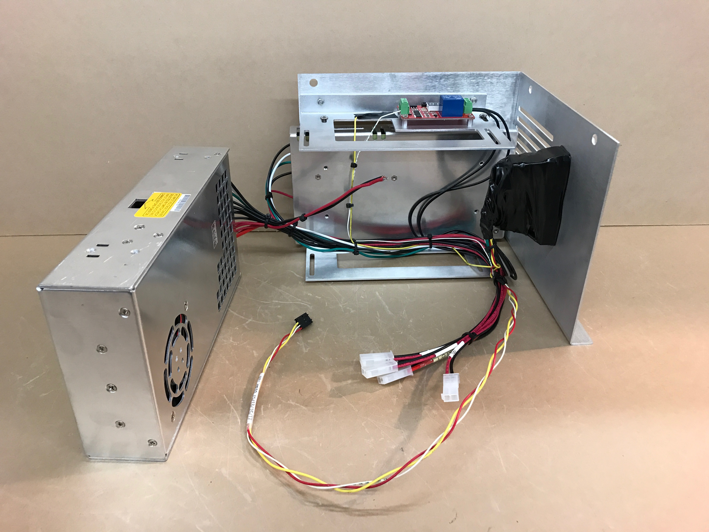 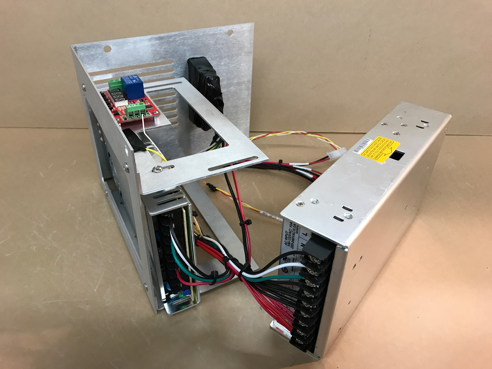
 24. Close up the routing zone by mounting the 12V power supply to the power supply brackets. Use x8 **M-004-07-005-BTN-S-SS (Bag 28)** (M4 x 5mm Button Head Screws). The finished assembly should look like:  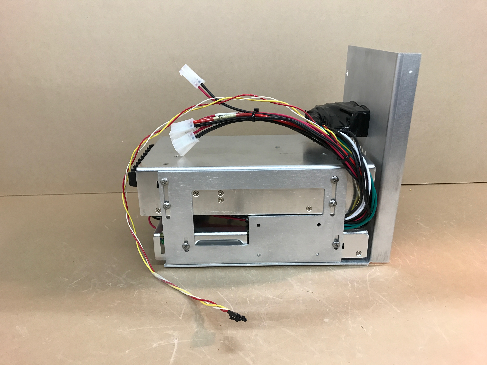
