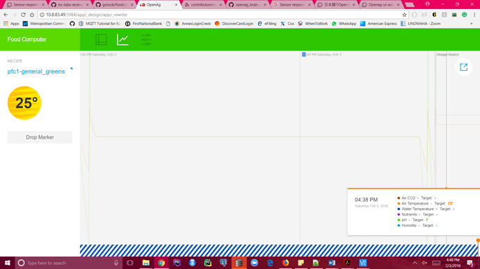
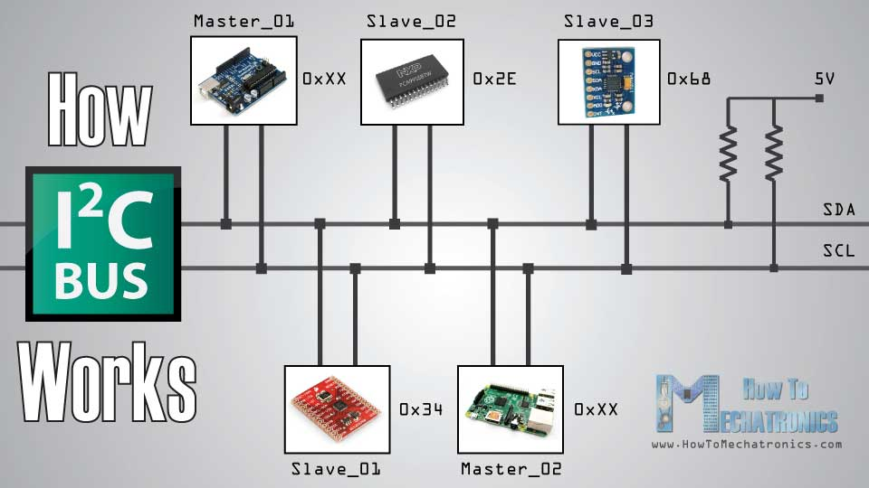

# Unable to Display Sensor Readings on UI

:house: [Back to Trouble Shooting](https://github.com/SachinPawaskarUNO/mav-openag-foodcomputer2.0/blob/master/docs/IssueTroubleShooting.md) || [Next-Arduino Test](./arduino-test.md)

We have connected all the sensors, but do not get any sensor readings from the sensors to be displayed on the UI.

We are using rosrun command to flash the arduino
> rosrun openag_brain firmware -t upload

To test, we are running the following command.
> rosrun openag_brain main personal_food_computer_v2.launch

We understood that 2 pull up resistors are needed that connect the I2C bus. Something like what is shown in the image below.

We later found that the pull up resistors are fabricated into the OpenAg Board.

One way of switching to I2C, that we have come across is -
- ve 5v,>>GND,

- jumper short TX to PGND.

- +ve 5V>>vcc,

- after the led change from GREEN to BLUE ,its done.

- Then connect put the kits connect to GPIO pins of Pi ,( I2C bus of Pi),USB port not connect to Arduino Mega 2560.

- stop the openag_brain.service and run

- pi@raspberrypi:~ $ sudo i2cdetect -y 1
>  REFERENCE: [OpenAg Community Forum](http://forum.openag.media.mit.edu/t/sensor-responded-with-the-wrong-function-code-255/)
> Complied by [Vivek](https://github.com/vbhat0891),[Deepika](https://github.com/Jantz021991),[Narahari](https://github.com/narahari-sundaragopalan)
