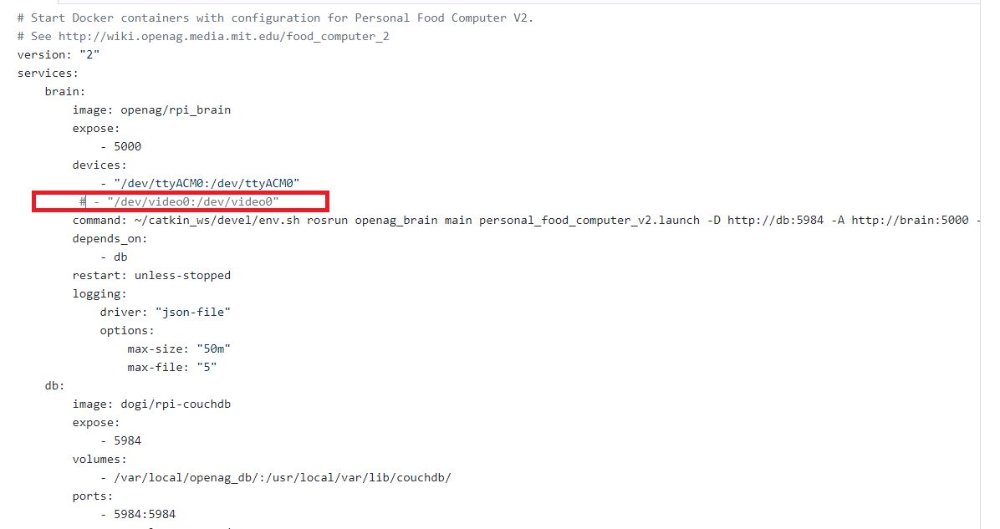

# **Installing Docker - Raspberry PI**
:house: [Back to Software Instructions Guide](https://github.com/SachinPawaskarUNO/mav-openag-foodcomputer2.0/blob/master/docs/SoftwareInstallation.md) || [Next - Brain Module Installation](./BrainInstallation.md)

We would need docker to containerise the environment that we would be requiring inorder to have all our requirements to have the brain up and running.

Let's go ahead and install the docker to achieve this goal -

For Installation,

System requirements -

1. Raspbian Pi3 with Raspbian Jessie installed.
2. Arduino MEGA 2560

Before we install docker containers, - Plugin your Arduino MEGA to one of the USB ports on the PI.
- Have a USB Camera connected as well

This is needed, since the docker-compose.yml file that is available in the repository requires that the PI is connected to Arduino and Camera. If you dont have the camera, then you can disable the service by commenting the line below -

>     - "/dev/video0:/dev/video0"

Clone the repository of the docker onto your PI -

> git clone http://github.com/OpenAgInitiative/openag_brain_docker_rpi
> cd openag_brain_docker_rpi

Install docker and docker-compose by running the following commands -

> sh install_docker.sh

Once this is done, reboot your RaspberryPi. This is required to refresh the user groups to contact the docker daemon.

Once rebooted, give in the following commands -

> cd openag_brain_docker_rpi
> docker-compose up -d

With this command, 2 docker containers will be started in the background.

# **Working with Docker**

Inorder to see the containers that are up and running,

> docker ps

To find out logs for the containers -

> docker logs -f openagbraindockerrpi_brain_1

To start and stop the containers -

> docker-compose start
> docker-compose stop
> docker-compose restart

# **Working with ROS Containers**

OpenAgBrain is powered by [ROS](http://www.ros.org/),Inorder to interact with these containers, give in -

> docker exec -it openagbraindockerrpi_brain_1 bash

Then activate the catkin workspace,

> source catkin_ws/devel/setup.bash

To view the list of Topics,

> rostopic list

To log output from a given ROS topic -

> rostopic echo <topic name>
