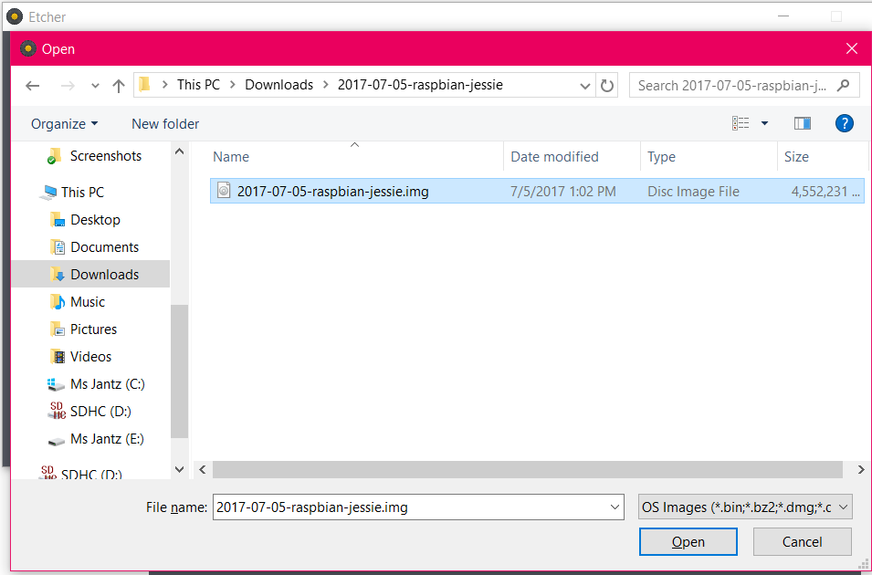

# **Installation Operating System - Raspbian**
:house: [Back to Software Instructions Guide](https://github.com/SachinPawaskarUNO/mav-openag-foodcomputer2.0/blob/master/docs/SoftwareInstallation.md)

First, install a compatible operating system on your SD Card that you will be using inside the Raspberry PI. For Raspberry Pi, we recommend Raspbian Jessie. The image can be downloaded  
>[Download Raspbian Jessie](http://downloads.raspberrypi.org/raspbian/images/)

and flashed to the SD card. For the current setup we have used
>[Image Download Path - Raspbian Jessie](http://downloads.raspberrypi.org/raspbian/images/raspbian-2017-07-05/)

To flash the operating system into SD card we have used a graphical SD
card writing tool called Etcher. The instructions to do so are as
follows:

-   Download [*Etcher*](https://etcher.io/) and install it in
    your laptop.

-   Connect an SD card reader with the SD card inside.

-   Open Etcher and select from your hard drive the Raspberry Pi .img or
    .zip file you wish to write to the SD card.

-   Open Etcher and follow the instructions as follows -

    -   Click on Select Image

    -   Navigate to the image that you get from downloading the zipped
        Raspbian Jessie.

        -   Then Click on Flash button.

    

      Fig 1: Select Image from Etcher

     

     Fig 2: Raspbian Jessie Image Navigate

     

 Fig 3: Flash to SD CARD

This would take upto 10-15 minutes to Flash and have the Operating System(OS) validated.

Once we have the OS flashed and validated, plug in the SD card into the raspberry PI and connect it to a monitor, the power cord to raspberry Pi, a ethernet cable and test the connectivity. The monitor should display the newly flashed operating system booting up.
We should be able to see the home screen.
