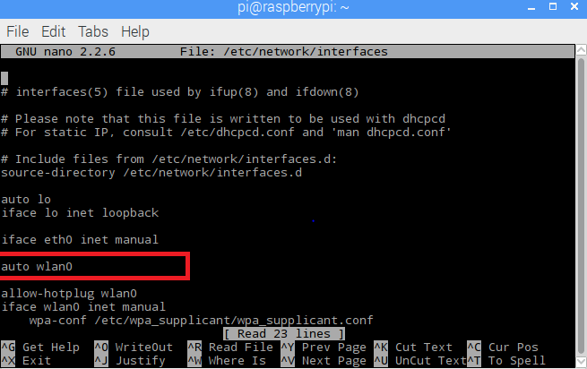
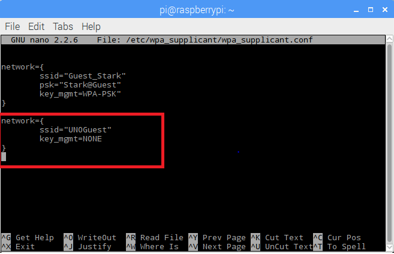
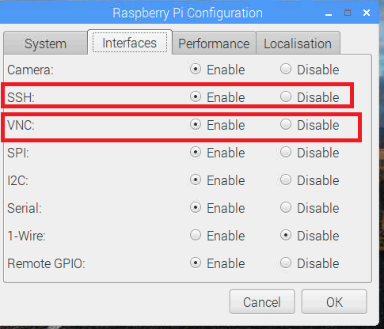

# **Setting Static Address in Raspberry PI**
[Back to Main](https://github.com/SachinPawaskarUNO/mav-openag-foodcomputer2.0/blob/master/docs/CompleteGuideFoodComputer.md)

There are different ways to get to know the IP address of your Raspberry PI. First of all, we would like to walk you through with how you can configure your WIFI. You can do this configuration if you have a display screen and a keyboard and a mouse to control the PI.

If not, go ahead and set the IP address of the Raspberry PI to a static address, post which you can SSH to the IP that you have set, from your local machine. Make sure you have a client to view the screen. We found VNC Viewer to be the best that served our purpose. Nevertheless, you need to have a display screen to first know the IP address and set it.

---------------------------------------

# **Configuring Wi-Fi**
Start by booting up the Raspberry PI connected to a display and a keyboard, Open up the Terminal and update the Interfaces file, give in the command-

>  sudo nano /etc/network/interfaces

Add the line below to auto connect to the networks from the Supplicant file-

>auto wlan0

ctrl-X, then type Y to quit and save

Open up the wpa_supplicant file from the terminal and add your network details within this file-
Type in the command:

> sudo nano /etc/wpa_supplicant/wpa_supplicant.conf

Give in your network details -

---------------------------------------

# **Setting Up Static Address - Raspberry PI**
First of all, find out the IP address of the PI and the gateway address, type in the command ifconfig to find out the IP address-
> ifconfig

The inet addr gives the IP address, you can either check the IP address of the wlan0(WiFi) or ethernet(eth0). We are setting the IP addres static for wifi.

We also have to find the gateway address, type in the command below-

> netstat -nr

Now change the dhcp configuration file to keep the IP address static.

> sudo nano /etc/dhcpcd.conf

Type in the following to make changes in the conf file-

> interface wlan0
        static ip_address=10.10.10.10
        static routers= 10.8.255.254
        static_domain_servers=8.8.8.8

Here, static ip_address needs to be the IP address that you would like to set, static routers would be your gateway address. While setting up the IP address of the PI, we need to make sure that the IP address is within the range of the gateway.

Make sure that, you have SSH and VNC enabled in your RaspberryPi. This is needed to connect the PI remotely from your local machines,which can be done by going to Raspberry PI configuration.

Go to the start screen of your PI, Preferences > Raspberry PI configuration

Go to the Interfaces tab and have the SSH enabled -

Update these changes and save the conf file. now reboot the PI by giving in-

> sudo reboot

The IP address of the Wlan0 is now static and would be static when you are in your local network.

---------------------------------------

# **Sharing Internet Over Ethernet of your Laptop**
Now, here we are trying to demonstrate on how we can have laptop's internet to be shared with the PI. Just follow these step by step instruction document -

1. Go to your Control Panel > Network and Internet > Network and Sharing Center. Click on the network that you are connected to-

2. Click on Properties (shown below), then go to Sharing and click on “Allow other network users to connect”. Make sure that the networking connection is changed to “Local Area Connection”:

This would provide a dynamic IP address to the Ethernet port of your laptop, now we need to check the IP of our laptop-

3. Now, set an IP that is in proximity to the address that you would like to have your PI. We have set it to 10.10.10.1 in our scenario and set our PI to 10.10.10.10.

Subnet mask is the mask address that you get when you do ifconfig on your PI for eth0(We are considering eth0 since we are setting IP address static on our ethernet port)

Default gateway is the gateway address that you find out from your PI by doing netstat -nr

By doing this, you are all set to connect to the Raspberry PI and you dont need an external display in future! All you need to have is an Ethernt port and an Ethernet cable to connect your laptop and your PI!

Finally in the next module, we will see how can you connect remotely to view PI's screen.

# **Remote connection - VNC Viewer**

Pre-requisite : VNC Viewer

Open your VNC Viewer, and type in the IP address of your PI in the search bar-

Give in the login credentials of the Pi, By default this is set to :

> Username : pi
> Password : raspberry

> 

You can now view the desktop of the PI :

> 

This is as simple as you can see!!
