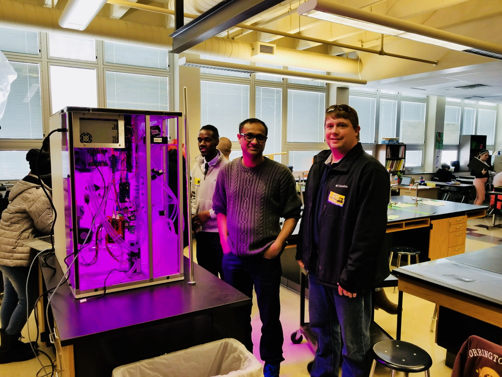
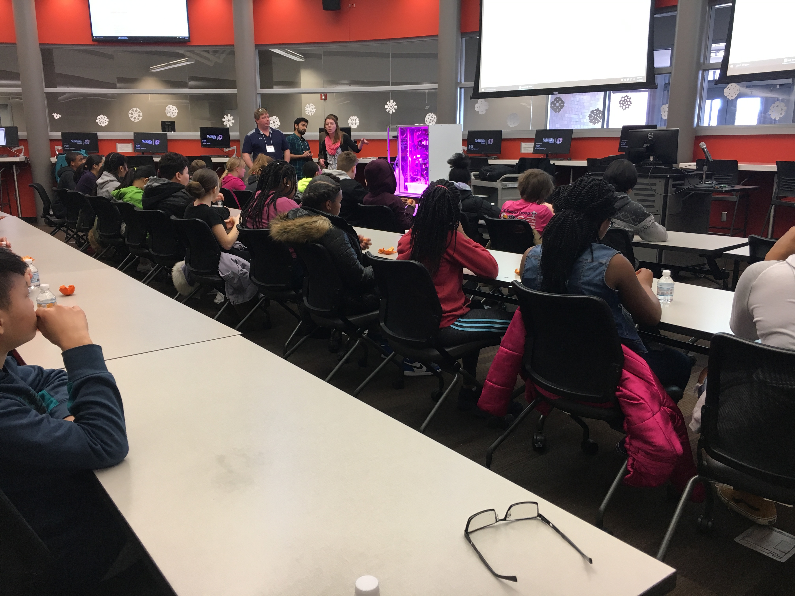
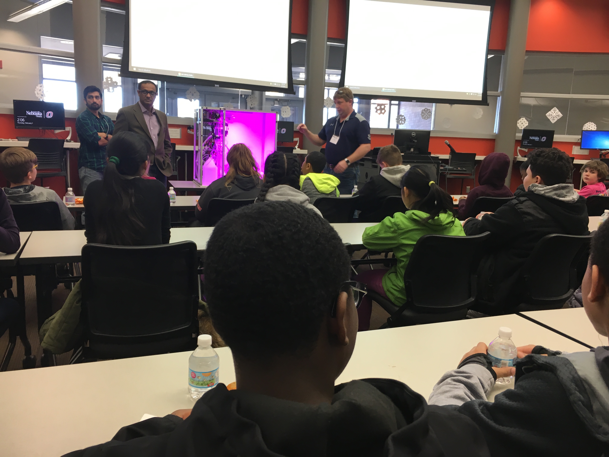
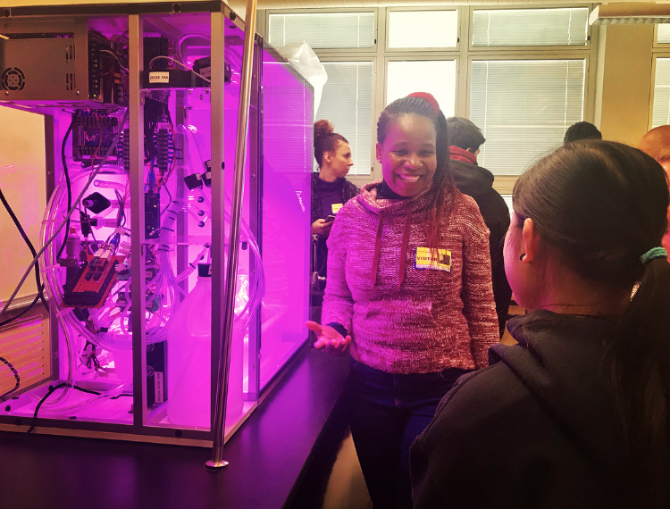
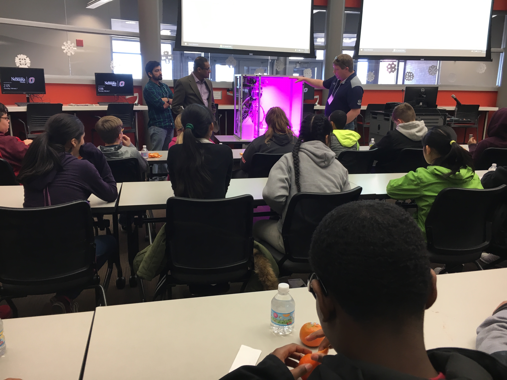

# This is the website for the UNO Community Engagement Center's Service Learning Academy for this project

## Service Learning Academy
Here are a few of the photos we have taken of the Food Computer project in conjunction with UNO, OPS King Science Center Middle School, and Parallel Technologies. The students will have a final presentation in early May to report on their findings over the semester. 

## Food Computer Photo Gallery
Here are a few of the photos we have taken of the Food Computer project in conjunction with UNO, OPS King Science Center Middle School, and Parallel Technologies. The students will have a final presentation in early May to report on their findings over the semester.

Dr. Pawaskar (left) and Jay (right) from UNO and Parallel Technologies with the Food Computer being installed at King Science Center.

Students from King Science Center are being introduced to the Food Computer during a presentation held on campus at UNO.

Students being introduced to their community partners for the semester.

  A UNO graduate student explaining components of the Food Computer to King Science students during the installation process.

